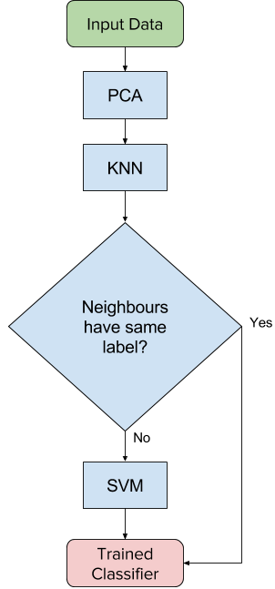
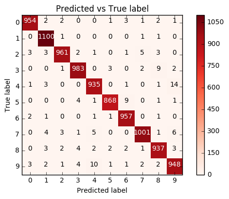

# Machine Learning Engineer Nanodegree
## Capstone Project
Tom Martin
30th January 2017

## I. Definition

### Project Overview

My project will examine the MNIST database of handwritten digits. The project 
aims are to deduce an accurate SVM classfier for this dataset and analyse its 
performance against a benchmark study, noted below.

This is a very well known dataset having attracted a great deal of academic 
attention since its inception. More broadly, the analysis of automated 
handwriting recognition has applications for fields where it is important to 
quickly and securely process handwritten documents at scale. For instance, this 
can be useful in processing historical documents, input to handheld devices via 
a stylus or pen, or determining authorship of incriminating documents.

Over the years, it has proved fruitful territory for examining a range
of machine learning classifiers, such as linear classifiers[1], svm[2], 
k-nearest neighbours[3], and a range of neural network implementations[4].
There have therefore been a number of different approaches shown to be suitable 
to classify the dataset correctly. A paper by Hartwick[5] is particularly 
relevant for this project as he has provided a clear analysis of the 
dataset without any further preprocessing with an SVM classifier. For these 
reasons, this paper will form a benchmark for the following analysis. 

### Problem Statement

The capstone will attempt to train and tune a SVM classifier that is able to 
correctly determine the number intended from the supplied image of a 
handwritten sample. The model produced will be trained, validated and tested 
against the supplied dataset.  The success of the classifier will be measured 
using the SciKit-Learn metric's module `metrics.accuracy_score`,
`metrics.confusion_matrix`. From these metrics we can derive both the error 
rate and per digit error rate in order to enable a direct comparsion with 
the benchmark model below. It should be mentioned that some of these metrics 
are typically used in problems of binary classifaction, but can be generalised 
for an arbitrary number of classes[6]. This is covered in more detail in the 
"Metrics" section.

I propose using a SVM classifier to train a solution that, with a reasonable 
level of accuracy, correctly maps a handwritten sample to the correct digit. 
A supervised classifier should be an appropriate solution to the problem as we 
have training data. There are also a number of academic studies that have had 
success with SVM classifiers[2]. Before building the model, I will use 
principal component analysis (PCA) with dimension reduction. PCA is 
used to reduce the feature space of the training data to reduce the overall 
training and testing time. This is especially useful for a dataset both as 
large and feature-rich as the MNIST dataset. It has been shown that in general 
PCA does not negatively impact the accuracy of a classifier, and has even been 
shown to boost the accuracy of the SVM classfier[7]. I will evaluate the 
classfier using two different kernels: Gaussian, or RBF kernel, and polynomial. 
The choice is for two reasons: Firstly, Both these kernels are useful in cases 
such as this where the data set is not linearly separable. Secondly, I want to 
make a direct comparison with the benchmark study, which used the Gaussian 
kernel. 

The trained classifier can be evaluated using a confusion matrix, and derived 
metrics to determine its degree of success. Furthermore, we can consider a 
number of previous models[8] of the dataset using a SVM classifier, which have 
accuracies around 99%.

### Metrics

The evaluation metrics for this model will be the confusion matrix, accuracy, 
error rater, and per digit error rate. The latter two are to enable a direct 
comparison with the benchmark, which calculates these values in the paper.

I will be focussing on the confusion matrix and accuracy to evaluate the 
classfier for the two main reasons. Firstly, the labels in the dataset are 
fairly uniformly distributed, as shown in figure 2 below. This means we can take 
the simpler option of just using accuracy as we do not need to consider 
imbalances between classes - accuracy will strongly correspond to other 
measures such as precision in this case. Secondly, this is a multi-class 
classification problem where we are more interested in correct classifactions 
than misclassifications, so accuracy is sufficient to meaningfully evaluate the 
classfier on its own. The confusion matrix will still contain useful 
information especially if there is strong presence of misclassifications on a 
per digit bases, which would not be as clear from accuracy alone.

A supervised classfier such as SVM has known labelled data, so we can determine 
the number of true positives, true negatives, false positives, and false 
negatives these are ultimately derived from the confusion matrix. To be clear, 
these terms are defined as follows:

* True positives: Entries that are correctly labelled
* True negatives: Entries that are correctly rejected
* False positives: Entries that a wrongly identified with a given label
* False negatives: Entries for a given label that are wrongly identified with 
other labels

In the general case, a confusion matrix is simply a matrix illustrating the 
mapping from the true labels to the predicted labels. Elements along the 
diagonal represent a correct classification, whereas the off-diagonal represent
a misclassification. A confusion matrix can be a useful check to 
see what digits in particular are most likely confused for one another. From 
here we can derive the accuracy.

Accuracy is given by the total number of correct classifcations, both true 
positives and true negatives divided by the total dataset population. This 
can be given by the following equation,

```math
accuracy = (tp + tn) / (tp + tn + fp + fn)
```

where tp, tn, fp, and fn stand for true positivem true negative, false positive, 
false negative respectively.

From this, the error rate or rate at which the classifier misclassifies can be 
derived,

```math
error rate = 1 - accuracy 
           = 1 - (tp + tn) / (tp + tn + fp + fn) 
           = (fp + fn) / (tp + tn + fp + fn)
```

To determine the error rate for a given digit I refer to the benchmark 
paper[5], which defines the error rate as the ratio of false negatives to the 
sum of true positives and false negatives.

```math
error rate (for given digit) = fn / tp + fn
```

This can be derived from the confusion matrix: For a given row, divide the 
off diagonal entries by the sum of all entries for that row.

These metrics altogether will give us a means to determine how well the 
classifier correctly labels the digits as well the error rate per digit. The 
error rate as well as all the other metrics discussed in this section will be 
calculated using the SciKit-Learn `metrics.accuracy_score`, 
`metrics.confusion_matrix` methods.

## II. Analysis

### Data Exploration

The MNIST dataset contatins 70000 samples of handwritten digits, labelled from 
0 to 9. These are split into subsamples of 60000 and 10000 for training and 
testing respectively. The samples themselve have been centred and normalised 
to a grid size of 28-by-28 pixels, with each training entry composed of 784 
features, corresponding the greyscale level for each pixel. The MNIST 
dataset in this case will be the MNIST original[9] dataset obtained via the 
mldata repository using SciKit-Learn's `datasets.fetch_mldata` method. A sample 
of the dataset is given below.


The class labels in the testing set are roughly uniformly distributed, with the 
number of occurences of each label ranging from around 6300 and 7900. The 
distribution is shown graphically in figure 2 below. This distribution of 
labels means that no special sampling needs to take place to train and test 
correctly, and as discussed above, means we can opt for the simpler choice of 
deriving only the accuracy as the evaluation metric.

On a historical note, this dataset is the result of subsampling the original 
NIST dataset so that is was overall more consistent, and more suitable for 
machine learning: mixing together the original training and testing sets. The 
samples were collected from a combination of American Census Bureau employees 
and American high school students. This dataset contains both training and 
testing samples, so no further data is needed to evaluate the classifier.

### Exploratory Visualization

The plot below illustrates the distribution of labels in the target data, 
showing them to be fairly uniformly distributed. This is useful in relation to 
the choice of evaluation metric, as noted above. Due to this uniformity, we can 
opt for the simpler choice of using just the accuracy as we due not need to 
consider imbalances and skew.


### Algorithms and Techniques

This report will train a scalable vector machine (SVM) classifier to correctly 
label the samples. SVM is a way of classifying data sets with a hyperplane or 
boundary bewteen data point clusters. This is achieved by algorithmically 
finding the hyperplane with maximum margin, or in other words finding the line 
that maximises the distance between itself and the points of the data set. SVM 
is particularly powerful when dealing with nonlinear data by employing the 
so-called kernel trick: mapping the input data points to a higher dimensional 
feature space.

The SVM provided by SciKit-Learn's `svm.SVC` module supports the following 
parameters relevant for this investigation,

* C - penalty parameter, how closely hyperplane follows the datapoints
* kernel - the kernel choice, either RBF or polynomial
* degree - the degree of the polynomial kernel
* gamma - kernel coefficient, defines radius of influence for a given datapoint

The specific parameter values will be decided by cycling through a range of 
valuesstarting from a set of values following the relevant literature. This 
technique is a simple and effective means of optimising the classifier, as a 
way of justifying our initial assumptions. Other parameters not specified here 
will be used at their default values.

Due to the size of the dataset used in this project it is necessary to use a 
hybrid approach[10]. This means initially running the dataset through a k 
nearest neighbours classifier (KNN) and only run digits through the SVM 
classifier where the k neighbours do not have the same label. Together this 
known as KNN-SVM, and has the dual advantage of achieving a high level of 
accuracy on a feature rich dataset using SVM, whilst offloading a large 
proportion of the classification problem to a much cheaper KNN classifier. In 
addition to the SVM parameters I will vary the following,

* PCA: `n_components`
* KNN: `n_neighbors`

to determine their effect on the classifier accuracy. The classifier will be 
trained with a validation set by performing a test/train split using 
SciKit-Learn's `model_selection.StratifiedShuffleSplit`. This is in order to 
perform a form of hyperparameter optimisation by running the classifier with a 
given set of paramters against multiple training and testing sets, to compensate 
for any possible overfitting with any one training set. This module in 
particular, will perform a test/train whilst preserving the frequency of each 
category in each subsample, so the frequency of occurence of each sample is 
similar. Each trained classifier will be used to evaluate the test set. The 
performance metrics to be used are discussed above.

Preprocessing will be done using PCA with dimension reduction. This is 
discussed at greater length below.

### Benchmark

This dataset is very well studied and as such, there are many comparable 
studies to check against. For the project, I will make direct comparison to 
the paper referenced above by Hartwick[5]. This paper produces results for a 
SVM classifier with Guassian kernel, with parameters,

```math
C = 10^6
gamma = (1/len(features)) * 10^-3.5 (approx. 4 * 10^-7)
```

The model in this paper achieves a error of around 1.4% against the MNIST 
testing set, the paper also gives the per digit error rate. Given all these 
results and the availability of the identical testing set, a direct comparison 
with this paper's results is possible.

However, unlike the benchmark study, I will perform preprocessing on the dataset 
using PCA. Following the study by Lei and Govindaraju[7] I 
will choose to model with several different numbers of principal components 
between 25 and 100, as this is where they found a boosted classifier 
performance. I will also use a hybrid approach, using a combination of KNN and 
SVM classifiers, due to the size of the dataset as discussed above.

## III. Methodology

### Data Preprocessing

The data was fetched using SciKit-Learn's `datasets.fetch_mldata`, which 
creates a local cache for subsequent reads.

Data preprocessing was achieved using PCA with dimensional reduction. This was 
to enable a speed up in the training and execution time of the classifier, 
which has been shown to not degrade performance in general - and has even let 
to some improvement. This is also a very necessary step when processing such 
a large and feature reach dataset such as MNIST especially when training on 
general purpose hardware. The number of components to use in this step comes 
follows from two considerations. Firstly, a previous study using PCA on the 
MNIST dataset showed boosted SVM performance for a number of principal 
components below 100[7]. Secondly, by looking at the explained variance ratio, 
we see that over 91% of the variance is accounted for by the top 100 
components.

```code
pca = PCA().fit(X) # where X is the imported training set
explained_variance = pca.explained_variance_ratio_
sum(explained_variance[101]) # => 91.6%
```

For my implementation, I used the Python `pickle` 
module to serialise the target and and preprocessed data samples to easily 
share across files.

PCA was performed before the test/train split to ensure consistent 
analysis, the dimensionality of the training data should be the same as the 
test data.

See `Downloading PCA and Caching.ipynb` in the `code_samples` directory for 
implementation details.


### Implementation

The full implementation for this project is illustrated in the figure below. 
As a whole, the project follows the approach given by Zhang et al.[10] known 
as SVM-KNN. I was not aware of the need to use a hybrid approach when I 
initially planned this project but this SVM Implementation does not scale well 
for larger datasets, with a reported order of growth between the square of the 
number of samples and the cube the number of samples[11].



Going from top to bottom through the following figure. Given the initial dataset, 
I performed PCA with dimensional reduction for three different numbers of 
principal components and serialised the result with the `pickle` module. A 
test/train split was then performed before moving on to training, in order to 
have a validation set to train against. For a given preprocessed dataset, I ran 
this though the KNN classifier to perform an initial classification. A 
subsequent call to the SVM classifier was only made if the given k neighbours 
do not have the same label i.e. a further classification is required. It is at 
this point that the the distance matrix is converted to a kernel matrix for SVM 
classifier. 

All the algorithms and modules used in the project implementation come from 
SciKit-Lean 0.18.1 libary. Those being,

for classifaction,

* `decomposition.PCA`
* `neighbors.KNeighborsClassifier`
* `svm.SVC`

for test/train split

* `model_selection.StratifiedShuffleSplit`

and to derive evaluation metrics

* `metrics.accuracy_score`
*  `metrics.confusion_matrix`

The training and evaluation step was done over a set of variables for both the 
KNN and SVM classifiers to perform a basic hyperparameter optimisation.

See the notebooks in the `code_samples` directory for implementation details.

### Refinement

The classifier refinement step is bundled as part of the classifier training. 
I used a test/train split to produce a validation set to use as part of the 
training step, then run the trained classifier on the test set. I used a range 
of parameters following from the my reading of the literature, this meant 
varying the number of principal components, the number of nearest neighbours, 
and the SVM parameters C, gamma, kernel and degree - for the polynomial kernel 
only.

A subset of results for the best performing parameters are shown below, note the 
standard deviation for each parameter set is quoted in parentheses.

Varying nearest neighbours, k, for constant number of principal components

| k   | PC  | Parameter Set | Average Test Set Accuracy (Standard Deviation) |
| --- | --- | ------------- | ---------------------------------------------- |
| 3   | 50  | 1             | 0.9804 (0.0008)                                |
| 5   | 50  | 1, 2          | 0.9828 (0.0005)                                |
| 7   | 50  | 1             | 0.9834 (0.0006)                                |

Varying number of principal components for constant nearest neighbours k

| k   | PC  | Parameter Set | Average Test Set Accuracy (Standard Deviation) |
| --- | --- | ------------- | ---------------------------------------------- |
| 7   | 25  | 1             | 0.9805 (0.0009)                                |
| 7   | 50  | 1             | 0.9834 (0.0006)                                |
| 7   | 100 | 1             | 0.9822 (0.0004)                                |

Parameter sets

Parameter set 1, all eight combinations of the following,

* `C` = { 1, 10, 100, 1000 }
* `degree` = 2
* `gamma` = ( 10^-3, 10^-4 }
* `kernel` = polynomial

Parameter set 2, either the two combinations of,

* `C` = 1
* `degree` = 2
* `gamma` = ( 10^-3, 10^-4 }
* `kernel` = polynomial

or the eight combinations of,

* `C` = { 1, 10, 100, 1000 }
* `degree` = 3
* `gamma` = ( 10^-3, 10^-4 }
* `kernel` = polynomial

Although varying the number of parameters did not appreciably increase the 
testing accuracy, we can spot a few trends,

* Increasing k improved the classifier accuracy. However, this comes at a 
cost of longer processing times
* Increasing PC improved classifier accuracy, more siginficantly than k. This 
is perhaps to be expected as the resulting dataset has more features to use. 
However, again this comes at a cost of longer processing times
* The parameter selection for SVM was not very significant for the final 
classifier - the best performing classifiers used eight parameter 
configurations. This is probably a consequence of using a hybrid approach: The 
input space to the SVM is fairly small
* A low degree polynomial kernel outperformed all other kernel choices - this 
is common in the NLP space, as these least overfit the data

See `Train and Optimise Classifier.ipynb` in the `code_samples` directory for 
implementation details.

## IV. Results

### Model Evaluation and Validation

To obtain the best performing classifier I performed a simple form of 
cross-validation, using the module `StratifiedShuffleSplit` to produce three 
different test and train sets to run each of the parameter sets against. This is 
to ensure a degree of robustness of the model: A good performing model is not 
simply overfit to one test/training set. For each parameter selection I found 
the average accuracy and reported the standard deviation. In all cases the 
standard deviation was very small, indicative of a high degree of consistency 
across trained models.

The best performing classifier had the following parameters,

* k = 7
* PC = 50
* SVM parameters are any from parameter set 1, above

These parameters were selected by comparing each trained classifier against the 
test set. These parameters make sense in light of theoretical considerations, 
namely: The number of principal components account for around 90% of the 
variance, see the "Data Preprocessing" section above.

See `Train and Optimise Classifier.ipynb` and `Evaluate Classifier.ipynb` in 
the `code_samples` directory for implementation details.

### Justification

The final classifier used an arbitrary selection of parameters from parameter 
set one.

The benchmark reported above produced a SVM classifier with an error of 1.4%. 
This compares favourably with the classfier trained in this project with has an 
error of 1.6% (corresponding to an accuracy of 98.4%). Discrepancies 
between the benchmark results may be due to,

* Preprocessing with PCA on the intial dataset, the benchmark study did not use 
any preprocessing
* Combination of KNN and SVM classifiers, the benchmark study trained the SVM 
directly on the MNIST set
* Different parameters used in final classifier, potentially related to 
previous two points

More detailed comparision with the benchmark follows by comparing the error 
per digit. This gives some indication of how the two classifiers differ and 
highlight the effect of preprocessing. Accounting for the overall larger error 
for the classifier trained in this project in relative terms, the error per 
digit was fairly similar dispite the preprocessing. In both cases the digits 1, 
0, 6 has the lowers error rates, and digit 9 had siginficantly greater error 
rates. Interesting differences between the classifiers are highlighted by 
looking at the error rate for digit 4, which had the 4th lowest error rate in 
the benchmark, but had the 2ns worst error rate in my trained classifier. 
It is not clear how this relates to PCA and KNN.

| Digit | Benchmark Error | Error per Digit | 
| ----- | --------------- | --------------- | 
| 0	    | 0.0061	        | 0.0124	        | 
| 1	    | 0.0052	        | 0.0027	        | 
| 2	    | 0.0164          | 0.0184	        | 
| 3	    | 0.0148	        | 0.0170          | 
| 4	    | 0.0132	        | 0.0209	        | 
| 5	    | 0.0168	        | 0.0181	        | 
| 6	    | 0.0104	        | 0.0062	        | 
| 7	    | 0.0184	        | 0.0196	        | 
| 8	    | 0.0184	        | 0.0199	        | 
| 9	    | 0.0277	        | 0.0267	        | 


## V. Conclusion

### Free-Form Visualization

The results for this project can be powerfully illustrated using a confusion 
matrix shown below. This is from the results of the optimised classifier 
detailed in the section "Justification" above.



This demonstrates a very powerful performance overall from the classifier, as 
well as highlighting the digits that proved more difficult relative to others. 
This is discussed in more detail above.

### Reflection

The workflow for this project was as follows,

1. Research of problem area and relevant benchmark in the literature
2. Finding and downloading relevant dataset
3. Preprocessed dataset using PCA
4. Initial classification of dataset using KNN
5. Trained SVM using range of parameters - only used samples not correctly labelled by KNN
6. Produced more results for most successful KNN-SVM classifier

The most difficult stages in the project were also happily the most 
interesting, those being steps 4 and 5. I was not clear in my previous 
research and project proposal how to efficiently run the SVM classifier against 
such a large dataset. This proved to be a real bottleneck for the project and 
required further investigation to proceed. However the hybrid approach used 
was both very effective and also a first for me.

The final model is robust, effective and efficient. In this project I have been 
able to derive a classifier with over 98% accuracy, highly competitive with 
the benchmark study, in a total running time of under 60s (on my laptop). 
This is extremely promising moving into a more general setting.

### Improvement

The major bottleneck for this project was the implementation of the SVM 
classifier used by SciKit-Learn. This SVM does not scale well for larger 
datasets as noted above in the "Implementation" section. A number of solutions 
to explore include trying to better utilise caching of calculated distances in 
memory, trying alternatives to SciKit-Learn like Vowpal Wabbit, or make better 
use of dedicated hardware, such as running the SVM on the GPU rather than a 
general purpose CPU. If a significant performance improvement can be made for 
the SVM classifier then I believe a future classifier could outperform the 
model created in this project. This is because a more opitimised classifier 
would be less reliant on preprocessing or hybrid approaches.

### References

[1] http://yann.lecun.com/exdb/publis/pdf/lecun-98.pdf "Gradient-Based Learning Applied to Document Recognition"

[2] https://people.eecs.berkeley.edu/~malik/cs294/decoste-scholkopf.pdf "Training Invariant Support Vector Machines"

[3] http://citeseerx.ist.psu.edu/viewdoc/download;jsessionid=E0F3BDC7642FB
A1D8E2811526BD0E596?doi=10.1.1.106.3963&rep=rep1&type=pdf "Deformation Models for Image Recognition"

[4] https://www.microsoft.com/en-us/research/publication/best-practices-for-convolutional-neural-networks-applied-to-visual-document-analysis/ "Best Practices for Convolutional Neural Networks Applied to Visual Document Analysis"

[5] https://cseweb.ucsd.edu/~jmcauley/cse190/reports/fa15/025.pdf "Reproducing Results of Guassian Kernel SVM classifiers on the MNIST Dataset"

[6] http://softclassval.r-forge.r-project.org/2013/2013-01-03-ChemomIntellLabSys
tTheorypaper.html "Validation of Soft Classification Models using Partial Class Memberships: An Extended Concept of Sensitivity & Co. applied to Grading of Astrocytoma Tissues"

[7] https://www.researchgate.net/profile/Giovanni_Felici/publication/226795010
_Feature_Selection_for_Data_Mining/links/53e413d70cf25d674e94b475.pdf#p
age=78  "Speeding Up Multi-class SVM Evaluation by PCA and Feature Selection"

[8] http://yann.lecun.com/exdb/mnist/ "The MNIST Database of Handwritten Digits"

[9] http://mldata.org/repository/data/viewslug/mnist-original/ "MNIST (original)"

[10] https://www.vision.caltech.edu/Image_Datasets/Caltech101/nhz_cvpr06.pdf SVM-KNN: Discriminative Nearest Neighbor Classification for Visual Category Recognition

[11] http://scikit-learn.org/stable/modules/svm.html#complexity "Support Vector Machines - Complexity"